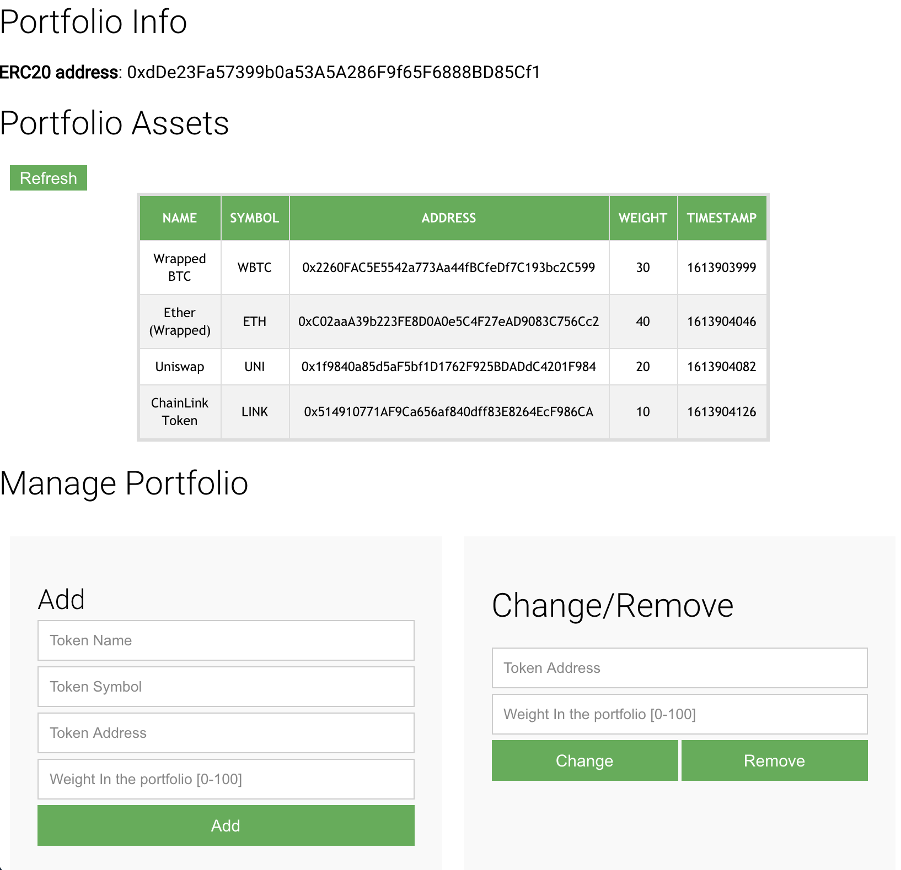

# Example of a tradeable investment portfolio on Ethereum

This project is a showcase of a simple ERC20 token deployed on a local Ethereum Blockchain. It allows the owner of the token to build a portfolio of other tokens by providing simple weights.

No fancy business like buying other tokens or following the price of the token.

Read more on this [blog post](https://www.investingsnippets.com/post/an-ethereum-erc20-token-mimicking-a-tradeable-investment-portfolio).



## Develop

The docker-compose file will build an alpine node:12 and install truffle and ganache.
Then at the startup phase it will start ganache, compile and migrate the contracts and
start the client application.

```
docker-compose run -p "3000:3000" -p "8545:8545" --rm develop
```

When everything is fine, open an **INCOGNITO** browser window and navigate to

`http://localhost:3000/`


## ATTENTION

If MetaMask is enabled on your browser, then make sure:

* MetaMask is NOT connected to the Mainnet! Do not run this if you’re connected to the Mainnet!
* Configure MetaMask to connect to `localhost:8545`
* If you have Privacy Mode enabled in MetaMask, make sure to give MetaMask permission to connect.
* Copy an account's key displayed when ganache is started and import it into MetaMask via Import Account. This imports an account to MetaMask preloaded with ETH funds.
